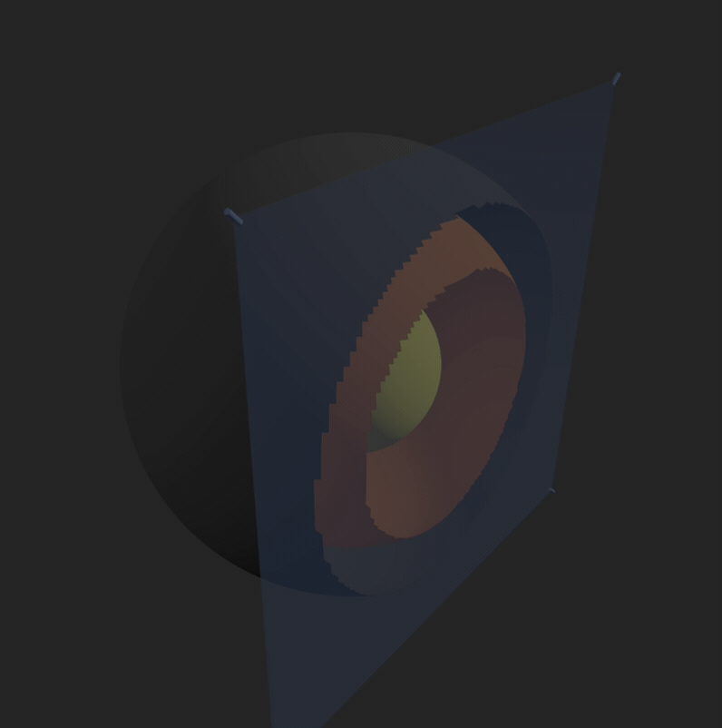

# WebGPU Globe - 3D Terrain Editor

## Demo GIFs


*Real-time terrain editing with brush controls and extrusion/compression modes*



*Polygon-based clipping with real-time transformations and layer control*


A real-time 3D terrain editing platform for prototyping GIS visualizations with WebGPU rendering.

## Purpose

**Prototyping interesting visualizations for GIS use cases** - exploring advanced 3D terrain editing, multi-layer Earth modeling, and real-time clipping techniques for geospatial applications.

## Features

| Feature | Description |
|---------|-------------|
| **Terrain Editing** | Real-time brush editing with extrude/compress modes |
| **Multi-Layer Earth** | Crust, Mantle, Core with independent opacity controls |
| **Advanced Clipping** | Polygon-based clipping with real-time updates |
| **3D Transformations** | Position, rotate, and scale clipping polygons |
| **WebGPU Rendering** | High-performance 3D rendering with fallback support |
| **Glass Materials** | Neon glass polygon with transmission effects |
| **Performance Monitoring** | Live vertex/triangle count and segment control |

## Setup

```bash
npm install
npm run dev
```

## Controls

### Terrain Editing
- **Edit Mode**: Toggle terrain editing
- **Brush Size**: Adjust editing radius (1-50)
- **Extrude/Compress**: Push/pull terrain modes
- **Intensity**: Control editing strength (0.1-2.0)

### Earth Layers
- **Layer Visibility**: Toggle Crust, Mantle, Core
- **Opacity Sliders**: Adjust layer transparency

### Clipping System
- **Real-time Toggle**: Enable/disable dynamic clipping
- **Layer Selection**: Choose which layers to clip
- **Direction**: Inside/Outside polygon clipping
- **Polygon Controls**: Position, rotation, size adjustment

### Performance
- **Segment Control**: Adjust geometry complexity
- **Live Stats**: Vertex/triangle count monitoring
- **Presets**: Quick resolution changes

## Technical Details

- **WebGPU renderer** with geometry clipping fallback
- **Non-destructive clipping** - fully reversible
- **Material clipping** for WebGL compatibility
- **Real-time polygon transformation**
- **Advanced PBR materials** for glass effects

## WebGPU Usage

**Current Implementation:**
- Uses `WebGPURenderer` for high-performance 3D rendering
- Clipping implemented via CPU-based geometry manipulation
- Future plan: Full WebGPU compute shaders for advanced features

**Planned WebGPU Enhancements:**
- **Adaptive tessellation** - dynamic mesh refinement near clipping areas
- **Signed Distance Fields (SDFs)** - mathematically perfect smooth clipping
- **Geometry shaders** - real-time edge smoothing
- **Compute shaders** - GPU-accelerated geometry processing

**Current Clipping Method:**
- Geometry-based "soft deletion" approach
- Vertex filtering and new geometry creation
- Works well but limited by base mesh tessellation

## Browser Requirements

- Chrome 113+ with WebGPU support
- Firefox 110+ with WebGPU support
- Safari 16.4+ with WebGPU support
